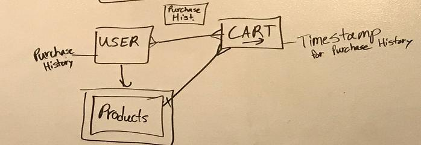
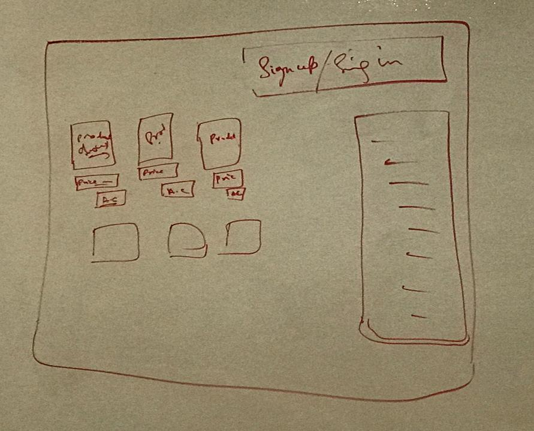

# Floral Shop
### By Sam Dyer, Rory Enright, and Pooja Sharma
#### In Association With General Assembly

Link to hosted application:
[Floral Shop By Sam Dyer, Rory Enright, and Pooja Sharma](https://better-microsoft.github.io/e-commerce-front-end/)

Link to [back-end repository](https://github.com/better-microsoft/e-commerce-back-end)

Technologies used:

-   [Webpack](https://webpack.github.io)
-   [Bootstrap](http://getbootstrap.com)
-   [Handlebars.js](http://handlebarsjs.com)
-   [Grunt](https://gruntjs.com/)
-   [Express](https://expressjs.com/)
-   [MongoDB](https://www.mongodb.com/)
-   [Stripe](https://stripe.com/docs/api)
-   [Mongoose](http://mongoosejs.com/)

Project History:

  The first step of this project started with a planning phase. Planning was incorporate with the utilization of a wire-frame scketch. The wire-frame used in project is linked below:

  

  And here is the relationship diagram:

  

  The project was broken up into the following steps:
- API Set up
- UI Set up
- Stripe Implementation

  The API was tricky at first, we got tripped up for the first few days trying to incorporate Mongoose and Mongodb together. Complex database
  queries proved to be more difficult than expected, due to differences between PostgreSQL and Mongodb. We spent an excessive amount of time reading through documentation and Stackoverflow.com. After about a week, we had a fully functioning backend ready to go.

  The UI was much easier than expected. With the implementation of handlebars, rendering dynamic lists (like a shopping cart or transaction history) was quite easy. All in all, the frontend was comfortable, and allowed us to focus more on the upcoming issue encountered by stripe.

  Stripe was easily the most challenging part of this project. The documentation on the website isn't explicitly writen for Express or Mongo, so most of the reference material we were using were from second-hand sources. The most frustrating part of Stripe, was the fact that we had no control of the backend, so we had to rely the responses from their API to know what was going on. On the second to last day of the project we had a break through and got it working.

Unsolved Problems

  The site is extremely slow due to unoptimized images and bulky code. In the future, we hope to slim down our code and modularize functions. We also planned to reformat the images used.

User Stories:

-When I sign up, I should be able to sign in
-When I sign in, I should be able to sign up, sign out, change password, and go to my cart. I should also see a product menu, which I can add to my cart.
-When I go to my cart, I should be about to delete items and pay for my cart total
-When I pay for my cart total, I should see an empty cart and a confirmation that my purchase was successful
